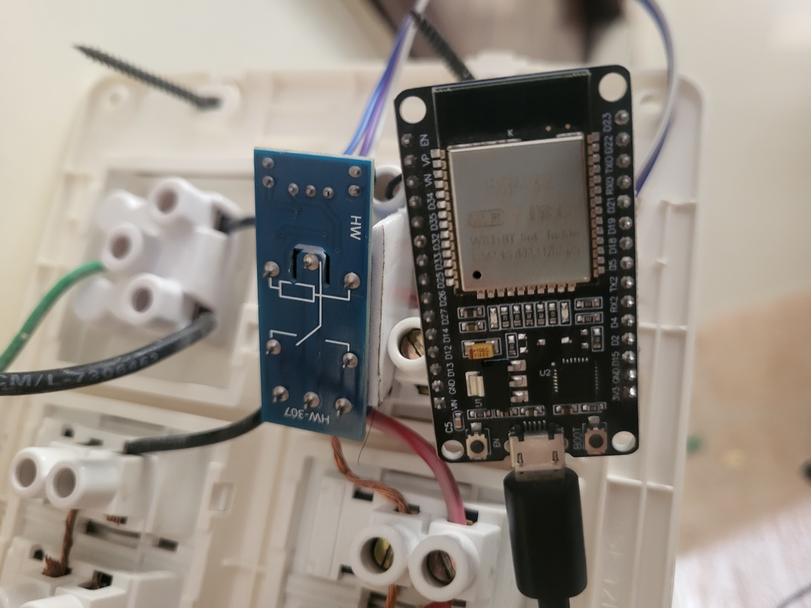
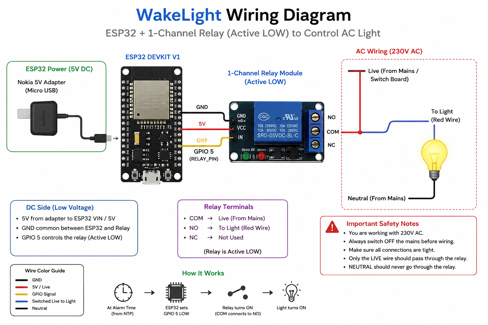
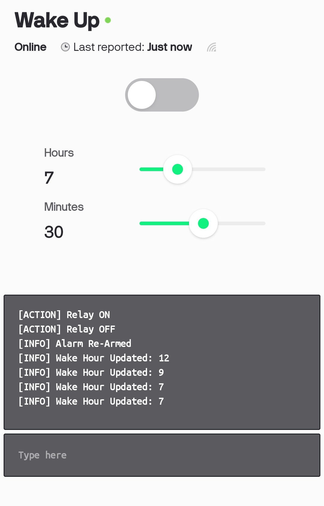

# 💡 WakeLight

WakeLight is an ESP32-based IoT wake-up light designed to solve a simple but real problem: **turning off phone alarms without actually waking up**.

Instead of relying on sound alone, WakeLight automatically switches on a room light at the scheduled time, forcing the user to physically get out of bed and turn it off.

This project combines embedded systems, IoT, networking, and real-world reliability features into a practical daily-use device.

---

## ✨ Features

- ⏰ Automatic wake-up light using real-world time
- 🌐 Google NTP time synchronization
- 📱 Alarm time configurable remotely using Blynk
- 🎛 Manual relay control from mobile app
- 🔄 Wi-Fi auto reconnection
- ☁️ Blynk auto reconnection
- ⚡ Boot recovery after power outages
- 💾 Alarm settings stored in ESP32 flash memory
- 🛡 ESP32 Watchdog protection
- 📋 Serial debugging and logging
- 🔌 Active LOW relay support

---

## 🛠 Hardware Used

- ESP32 DevKit V1
- 1-Channel Relay Module
- 5V Power Adapter
- Jumper Wires
- AC Room Light (230V)

---

## 📚 Software Stack

- Arduino IDE
- ESP32 Arduino Core
- Blynk IoT
- Google Public NTP
- C++

---

## ⚙️ How It Works

1. ESP32 boots up.
2. Connects to Wi-Fi.
3. Connects to Blynk Cloud.
4. Synchronizes time using Google NTP.
5. Waits until the configured alarm time.
6. Activates the relay.
7. Room light turns ON.
8. User gets out of bed and switches OFF the power manually.

---

## 🔧 Reliability Features

- Automatic Wi-Fi reconnection
- Automatic Blynk reconnection
- NTP retry mechanism
- Boot recovery logic after unexpected power loss
- One alarm trigger per day
- Dynamic alarm re-arming when alarm time changes
- Watchdog timer to recover from firmware hangs

---

## 📱 Blynk Dashboard

| Virtual Pin | Function |
|-------------|----------|
| V0 | Manual Relay Control |
| V1 | Wake Hour |
| V2 | Wake Minute |
| V3 | Relay Status LED |
| V4 | Terminal Logs |

---

## 📂 Project Structure

```
WakeLight/
│
├── Firmware/
│   └── WakeLight_v1.0.ino
│
├── Images/
│   ├── Hardware.jpg
│   ├── Wiring.jpg
│   └── BlynkDashboard.jpg
│
├── README.md
└── LICENSE
```

---

## 🚀 Future Improvements

- OTA Firmware Updates
- Multiple Alarm Support
- Weekday / Weekend Scheduling
- Sunrise Fade Effect using PWM
- Custom PCB Design
- 3D Printed Enclosure
- Battery Backup
- Web Dashboard

---

## 📸 Demo

### Hardware



### Wiring



### Blynk Dashboard



---

## 🎯 Why I Built This

I had developed a habit of unconsciously turning off my phone alarm without actually waking up.

To solve this, I built WakeLight—a simple IoT device that automatically switches on my room light at the alarm time, forcing me to get out of bed to turn it off.

This project evolved from a basic relay experiment into a complete embedded IoT system featuring cloud connectivity, fault recovery, and reliable scheduling.

---

## 🏷 Version

**WakeLight v1.0.0**

---

## 📄 License

This project is released under the MIT License.

---

⭐ If you found this project interesting, consider starring the repository!
